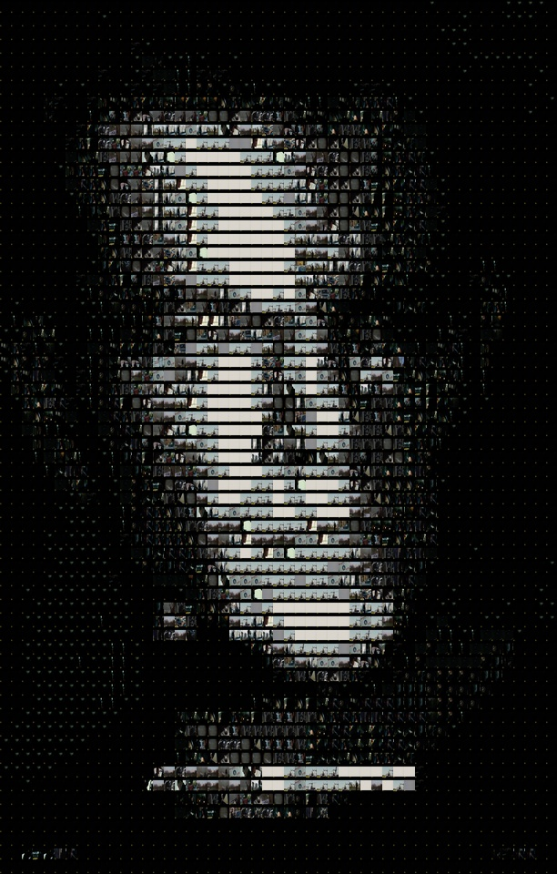
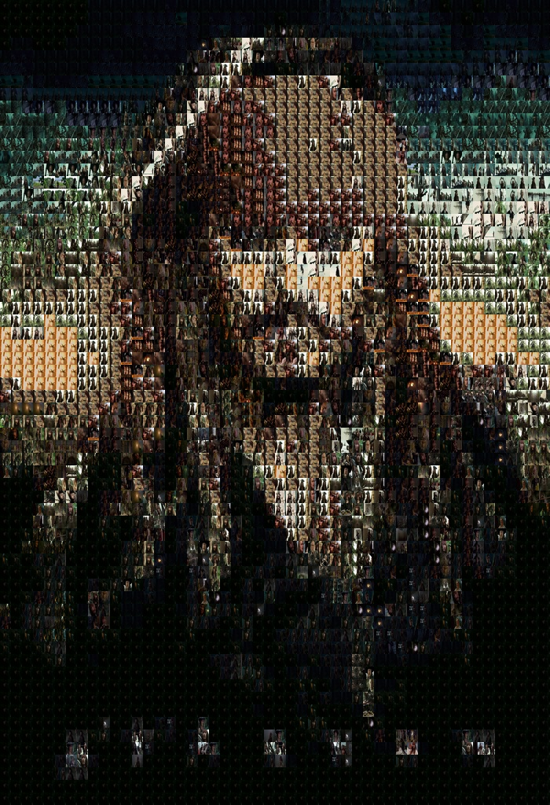

# 🎨 Image Mosaic Generator

Create stunning image mosaics by recreating any image using a collection of tile images or video frames. Perfect for artistic projects, photo collages, and creative visualizations.

## 🖼️ Gallery

See video mosaics in action! Compare the original images with their mosaic recreations created from video frames.

### Jason Bourne Mosaic

<table>
<tr>
<td width="50%">

**Original Image**


</td>
<td width="50%">

**Mosaic from Video Frames**



</td>
</tr>
</table>

*Created from: "Four Times Jason Bourne Outsmarts the CIA" video (1473 frames extracted)*

### Jack Sparrow Mosaic

<table>
<tr>
<td width="50%">

**Original Image**


</td>
<td width="50%">

**Mosaic from Video Frames**



</td>
</tr>
</table>

*Created from: "Jack Sparrow being the best pirate you've ever seen for 17 minutes straight" video*

> **Note:** To display the original images in the gallery above, add them to the project directory with the names `jason_bourne_original.jpg` and `jack_sparrow_original.jpg`.

---

## 📑 Table of Contents

- [Quick Start](#-quick-start)
- [Installation](#-installation)
- [Basic Usage](#-basic-usage)
  - [Image Mosaic](#image-mosaic-from-image-tiles)
  - [Video Mosaic](#video-mosaic-from-video-frames)
- [Advanced Features](#-advanced-features)
- [Command Reference](#-command-reference)
- [Tips & Best Practices](#-tips--best-practices)
- [Troubleshooting](#-troubleshooting)

---

## 🚀 Quick Start

### Installation

Install the required dependencies:

```bash
pip install -r requirements.txt
```

Or install individually:
```bash
pip install Pillow opencv-python
```

### Your First Mosaic

**From image tiles:**
```bash
python image_mosaic.py photo.jpg tiles_folder/ output.jpg
```

**From video frames:**
```bash
python video_mosaic.py movie.mp4 photo.jpg output.jpg
```

That's it! The tool will automatically create a mosaic using your tiles or video frames.

---

## 📖 Basic Usage

### Image Mosaic (from image tiles)

Create a mosaic using images from a folder as tiles.

#### Basic Example
```bash
python image_mosaic.py target.jpg tiles/ mosaic.jpg
```

This command:
- Takes `target.jpg` as the image to recreate
- Uses all images in the `tiles/` folder as mosaic pieces
- Saves the result as `mosaic.jpg`

#### Specify Grid Size
```bash
python image_mosaic.py target.jpg tiles/ mosaic.jpg --grid 50 50
```

Creates a 50×50 grid (2,500 tiles total) for more detail.

#### Add Borders
```bash
python image_mosaic.py target.jpg tiles/ mosaic.jpg --border 2
```

Adds 2-pixel borders between tiles for a classic mosaic look.

---

### Video Mosaic (from video frames)

Create a mosaic using frames extracted from a video file.

#### Basic Example
```bash
python video_mosaic.py movie.mp4 target.jpg mosaic.jpg
```

This command:
- Extracts 1 frame per second from `movie.mp4`
- Uses those frames as tiles to recreate `target.jpg`
- Saves the result as `mosaic.jpg`

#### Extract More Frames
```bash
python video_mosaic.py movie.mp4 target.jpg mosaic.jpg --interval 0.5
```

Extracts a frame every 0.5 seconds (2 frames per second) for more tile options.

#### Limit Frame Count
```bash
python video_mosaic.py movie.mp4 target.jpg mosaic.jpg --max-frames 500
```

Limits extraction to 500 frames to speed up processing for long videos.

#### Resize Frames for Faster Processing (Recommended for 1000+ frames)
```bash
python video_mosaic.py movie.mp4 target.jpg mosaic.jpg --frame-size 200 200
```

**Important**: If you have 1000+ frames, resize them first! Loading 1500+ full-resolution frames (1920x1080) can take 10+ minutes. Resizing to 200x200 makes it 50× faster.

#### Keep Extracted Frames
```bash
python video_mosaic.py movie.mp4 target.jpg mosaic.jpg --keep-frames
```

Saves the extracted frames to reuse for other mosaics.

---

## ⚙️ Advanced Features

Once you're comfortable with the basics, explore these powerful options:

### Color Matching Algorithms

Choose how tiles are matched to image regions:

- **RGB** (default): Fast, standard color matching
  ```bash
  python image_mosaic.py target.jpg tiles/ output.jpg --color-method rgb
  ```

- **LAB**: Perceptually accurate, better for photos
  ```bash
  python image_mosaic.py target.jpg tiles/ output.jpg --color-method lab
  ```

- **Weighted**: Accounts for human eye sensitivity
  ```bash
  python image_mosaic.py target.jpg tiles/ output.jpg --color-method weighted
  ```

### Tile Rotation

Enable automatic rotation (0°, 90°, 180°, 270°) for better color matching:

```bash
python image_mosaic.py target.jpg tiles/ output.jpg --rotation
```

### Limit Tile Reuse

Prevent the same tile from being used too many times:

```bash
python image_mosaic.py target.jpg tiles/ output.jpg --max-reuse 5
```

Each tile can only be used 5 times, ensuring more variety.

### Blending Modes

Blend tiles with the original image for artistic effects:

```bash
# Overlay blend (subtle)
python image_mosaic.py target.jpg tiles/ output.jpg --blend overlay --blend-opacity 0.3

# Multiply blend (darker)
python image_mosaic.py target.jpg tiles/ output.jpg --blend multiply --blend-opacity 0.5

# Screen blend (lighter)
python image_mosaic.py target.jpg tiles/ output.jpg --blend screen --blend-opacity 0.4
```

### Color Enhancements

Adjust brightness, contrast, and saturation:

```bash
python image_mosaic.py target.jpg tiles/ output.jpg --brightness 1.2 --saturation 1.3 --contrast 1.1
```

- Values > 1.0 increase the effect
- Values < 1.0 decrease the effect
- 1.0 = no change

### Custom Borders

Add colored borders between tiles:

```bash
# White borders
python image_mosaic.py target.jpg tiles/ output.jpg --border 2 --border-color 255 255 255

# Red borders
python image_mosaic.py target.jpg tiles/ output.jpg --border 1 --border-color 255 0 0
```

### Statistics

View detailed information about tile usage:

```bash
python image_mosaic.py target.jpg tiles/ output.jpg --stats
```

Shows which tiles were used most/least, usage rates, and more.

### Batch Processing

Process multiple images at once:

```bash
python image_mosaic.py --batch input_folder/ tiles/ output_folder/ --grid 50 50
```

Processes all images in `input_folder/` and saves results to `output_folder/`.

---

## 📚 Command Reference

### `image_mosaic.py`

**Basic Syntax:**
```bash
python image_mosaic.py <target_image> <tile_folder> <output>
```

**Arguments:**

| Argument | Description | Example |
|----------|-------------|---------|
| `target_image` | Image to recreate as mosaic | `photo.jpg` |
| `tile_folder` | Folder containing tile images | `tiles/` |
| `output` | Output mosaic file | `mosaic.jpg` |

**Options:**

| Option | Description | Default |
|--------|-------------|---------|
| `--grid ROWS COLS` | Grid size (rows × columns) | Auto |
| `--tile-size W H` | Size of each tile in pixels | Auto |
| `--color-method {rgb,lab,weighted}` | Color matching algorithm | `rgb` |
| `--sampling {average,center,dominant}` | Region color sampling method | `average` |
| `--rotation` | Enable tile rotation | Disabled |
| `--max-reuse N` | Max times a tile can be reused | Unlimited |
| `--blend {none,overlay,multiply,screen,soft_light}` | Blending mode | `none` |
| `--blend-opacity FLOAT` | Blending opacity (0.0-1.0) | `0.5` |
| `--brightness FLOAT` | Brightness multiplier | `1.0` |
| `--contrast FLOAT` | Contrast multiplier | `1.0` |
| `--saturation FLOAT` | Saturation multiplier | `1.0` |
| `--border WIDTH` | Border width in pixels | `0` |
| `--border-color R G B` | Border RGB color | `0 0 0` (black) |
| `--stats` | Show statistics | Disabled |
| `--batch` | Batch processing mode | Disabled |

### `video_mosaic.py`

**Basic Syntax:**
```bash
python video_mosaic.py <video> <target_image> <output>
```

**Arguments:**

| Argument | Description | Example |
|----------|-------------|---------|
| `video` | Input video file | `movie.mp4` |
| `target_image` | Image to recreate as mosaic | `photo.jpg` |
| `output` | Output mosaic file | `mosaic.jpg` |

**Video-Specific Options:**

| Option | Description | Default |
|--------|-------------|---------|
| `--interval SECONDS` | Time between frame extractions | `1.0` |
| `--max-frames N` | Maximum frames to extract | All |
| `--frame-size W H` | Resize frames before using | Original |
| `--keep-frames` | Keep extracted frames | Delete |
| `--frames-folder PATH` | Custom folder for frames | Temp |

**Note:** All mosaic options from `image_mosaic.py` are also available (grid, color-method, rotation, etc.)

---

## 💡 Tips & Best Practices

### Tile Collection
- **More tiles = better results**: Collect 100+ diverse images for best quality
- **Color variety**: Include tiles with different colors, not just similar ones
- **Quality matters**: Higher resolution tiles improve detail (they'll be resized automatically)

### Grid Size
- **Small grids (20-30)**: Fast, artistic, less detail
- **Medium grids (50-100)**: Good balance of detail and speed
- **Large grids (150+)**: High detail, slower processing

### Color Matching
- Use `--color-method lab` for photographic images
- Use `--color-method rgb` for faster processing
- Enable `--rotation` to significantly improve match quality

### Video Mosaics
- **Interval**: 1.0 second works well for most videos
- **Frame limits**: Use `--max-frames` for very long videos
- **Frame resizing**: **IMPORTANT** - Use `--frame-size 200 200` to resize frames before processing. This dramatically speeds up loading 1000+ frames and reduces memory usage. Without this, processing 1500+ full-resolution frames can take 10+ minutes just to load.

### Performance
- LAB color matching is slower but produces better results
- Tile rotation increases processing time (4× more tiles to consider)
- Larger grids take exponentially longer

---

## 🔧 Troubleshooting

**"No image files found"**
- Check that your tile folder contains image files (JPG, PNG, etc.)
- Ensure folder permissions are correct

**"Out of memory"**
- Reduce grid size (e.g., `--grid 30 30`)
- Resize frames with `--frame-size` for video mosaics
- Process smaller target images

**Poor color matching**
- Enable `--rotation` for better matches
- Use `--color-method lab` for perceptual accuracy
- Increase your tile collection size

**Tiles look repetitive**
- Use `--max-reuse 5-10` to limit tile reuse
- Collect more diverse tile images

**Processing too slow**
- Disable `--rotation`
- Use `--color-method rgb` instead of `lab`
- Reduce grid size
- For videos: use `--max-frames` to limit frame count

**Video won't open**
- Ensure OpenCV is installed: `pip install opencv-python`
- Check video file format (MP4, AVI, MOV, MKV supported)
- Verify video file isn't corrupted

---

## 📝 Examples

### Command Examples

#### High-Quality Artistic Mosaic
```bash
python image_mosaic.py photo.jpg tiles/ artistic.jpg \
  --color-method lab \
  --rotation \
  --grid 100 100 \
  --max-reuse 10 \
  --blend soft_light \
  --blend-opacity 0.3 \
  --saturation 1.2
```

#### Pixel Art Style
```bash
python image_mosaic.py photo.jpg tiles/ pixel_art.jpg \
  --grid 30 30 \
  --border 1 \
  --border-color 0 0 0 \
  --brightness 1.1 \
  --contrast 1.2
```

#### Video Mosaic with All Features
```bash
python video_mosaic.py movie.mp4 photo.jpg mosaic.jpg \
  --interval 1.0 \
  --grid 100 100 \
  --color-method lab \
  --rotation \
  --blend overlay \
  --blend-opacity 0.3 \
  --stats
```

---

## 📄 License

This project is licensed under the Apache License 2.0. See the [LICENSE](LICENSE) file for details.

## 🤝 Contributing

Contributions, suggestions, and improvements are welcome!
